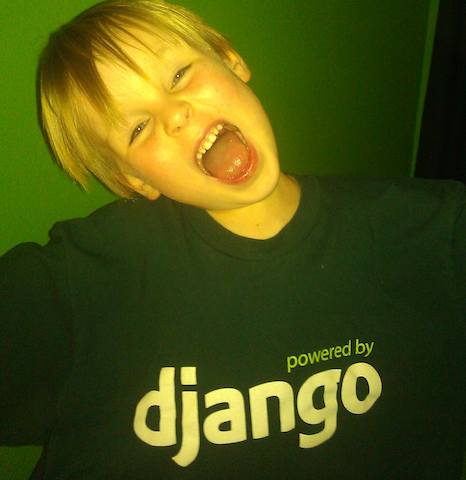

.. Julython 

Building Julython
=================================================

by Robert Myers

robert@julython.org

Topics
------

* What is Julython??
* Why Appengine
* GAE Django
* Multiple WSGI Handlers in an Application
* Writing a simple API with webapp2
* Deferred tasks
* Using the Channel API for live feed

What is Julython?
====================

Julython
--------

We started Julython to encourage people to write Python. 

We work best with artificial deadlines and superficial point/reward systems.

So far we have 555 participants with over 12500 commits in 735 projects!

Why Appengine?
====================

Why should I use Google Appengine?
----------------------------------

* PAAS vs IAAS
* Auto Scaling
* MegaStore (big table)
* TaskQueue
* Blobstore
* Memcache
* Channel API
* Logging/Errors Dashboard

Why didn't you use Heroku?
===========================

Heroku
------

* Heroku Is Awesome
* Tons of free tools
* Works out of the box with Django
* Swiss army knife of tools
* Lets you do what you want

Django on Appengine
===================

Django is fun!!
---------------

``gae_django`` 
===============

http://github.com/rmyers/gae_django/

Features
--------

* AdminSite that works with Appengine
* Auth backends (oauth support)
* Transaction support
* http://github.com/rmyers/gae_django

Using multiple WSGI processes
=============================

Benefits
--------

* Loosely coupled Applications
* Use Django for frontend and Light-weight handler for backend

Example App.yaml
----------------

Here is an example::

    application: julython
    ...
    
    handlers:
    - url: /static
      static_dir: july/static_root
    
    - url: /_ah/channel/(connected|disconnected)/
      script: july.channel.app
    
    - url: /api.*
      script: july.api.app
    
    - url: /.*
      script: july.main.app

Writing a simple API with webapp2
=================================

Simple API with webapp2
-----------------------

Base Handler::

    class API(webapp2.RequestHandler):
        
        def options(self):
            """Be a good netizen citizen and return HTTP verbs allowed."""
            valid = ', '.join(webapp2._get_handler_methods(self))
            self.response.set_status(200)
            self.response.headers['Allow'] = valid
            return self.response.out
        
        def respond_json(self, message, status_code=200):
            self.response.set_status(status_code)
            self.response.headers['Content-type'] = 'application/json'
            self.response.headers['Access-Control-Allow-Origin'] = '*'
            resp = json.dumps(message)
            return self.response.out.write(resp)

Github/Bitbucket Hook
----------------------

::

    class PostCallbackHandler(API):

        def parse_commits(self, commits):
            """Takes a list of raw commit data and returns a dict"""
        
        def parse_payload(self):
            payload = self.request.params.get('payload')
            return self.parse_commits(payload)
        
        def post(self):
            success = []
            for commit in self.parse_payload():
                success.append(Commit.make_commit())
            self.respond_json(success, status_code=201)

Github
------

::

    class GithubHandler(PostCallbackHandler):
        """
            payload=>"{
                  "repository": {
                    "url": "http://github.com/defunkt/github",
                    ...
                  },
                  "commits": [
                    {
                      "id": "41a212ee83ca127e3c8cf465891ab7216a705f59",
                      "url": "http://github.com/defunkt/github/commit/41a212ee83ca127e3c8cf465891ab7216a705f59",
                      "author": {
                        "email": "chris@ozmm.org",
                        "name": "Chris Wanstrath"
                      },
                      "message": "okay i give in",
                      "timestamp": "2008-02-15T14:57:17-08:00",
                      "added": ["filepath.rb"]
                    },
                    {
                      "id": "de8251ff97ee194a289832576287d6f8ad74e3d0",
                      "url": "http://github.com/defunkt/github/commit/de8251ff97ee194a289832576287d6f8ad74e3d0",
                      "author": {
                        "email": "chris@ozmm.org",
                        "name": "Chris Wanstrath"
                      },
                      "message": "update pricing a tad",
                      "timestamp": "2008-02-15T14:36:34-08:00"
                    }
                  ],...
        """
    
            
Deferred tasks
==============

Problem People change their location
------------------------------------

* Because this is no-sql we don't have a true relation
* Data is denormalized on the Location model
* Need to fix totals after a change

Solution
--------

Create the denormalizaion code `fix_location` 
then simply import the deferred library and call it::

    from google.appengine.ext import deferred
    
    @login_required
    def edit_profile(request, username, template_name='people/edit.html'):
        from forms import EditUserForm
        user = User.get_by_auth_id('own:%s' % username)
        existing_team = str(getattr(user, 'team_slug', ''))
        
        form = EditUserForm(request.POST or None, user=request.user)
        if form.is_valid():
            user.put()
            
            if user.location_slug != existing_slug:
                # Defer a couple tasks to update the locations
                deferred.defer(fix_location, str(user.location_slug))
                deferred.defer(fix_location, existing_slug)
    

Using the Channel API for live feed
===================================

Dead simple
-----------

In your view simply add a token::

    from google.appengine.api import channel
    
    # Julython live stuffs
    token_key = 'live_token:%s' % request.user.username
    token = memcache.get(token_key)
    if token is None:
        token = channel.create_channel(request.user.username)
        memcache.set(token_key, token, time=7000)

Template
---------

Add the proper js lib and connect the callbacks::

    
    

Send stuff to the channel
-------------------------

Create a simple deferred task after a commit is created to send a message::

    def send_live_message(key):
        """Deferred task for sending messages to the open channels."""
        
        message_key = model.Key(urlsafe=key)
        message = message_key.get()
        
        # Open connections stored in Connection Model
        connections = Connection.query().filter(Connection.timestamp >= oldest).fetch(200, keys_only=True)
        
        for connection in connections:
            channel.send_message(connection.id(), message.to_json())

Questions
=========
    
.. toctree::
   :maxdepth: 2